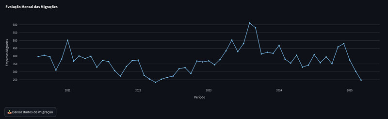
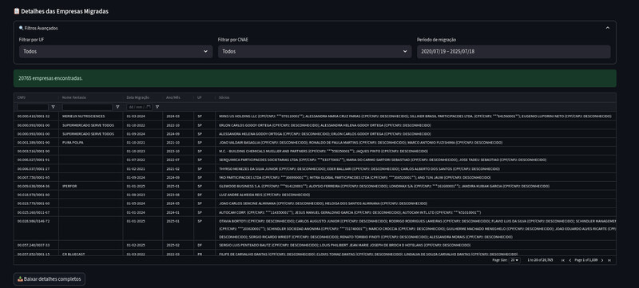

# ⚡ Energy Market Analytics Dashboard

[](https://streamlit.io)
[](https://www.docker.com)
[](LICENSE)

**Solução completa para análise de empresas no Mercado Livre de Energia**, integrando dados da Receita Federal e CCEE em um dashboard interativo.

👉 [Acesse a Demonstração](#) | 📽️ [Vídeo Tour](#)

---

## ✨ Destaques do Projeto

<div align="center">
  
  <p><em>Visualização completa do fluxo de migração entre 2020-2025</em></p>
</div>

### 🎯 Principais Funcionalidades

| Feature | Descrição | Screenshot |
|---------|-----------|------------|
| **Análise Temporal** | Evolução das migrações por mês/ano |  |
| **Perfil das Empresas** | Detalhes cadastrais + societários |  |
| **Filtros Inteligentes** | Busca por UF, CNAE e período |  |
| **Exportação de Dados** | CSV completo com todos os campos |  |

---

## 🛠️ Tecnologias Utilizadas

<div align="center">
  
  
  
  
</div>

**Stack Técnica:**
- **Backend**: Python + PostgreSQL (Dockerized)
- **ETL**: Pandas + Psycopg2
- **Visualização**: Streamlit + Plotly
- **Infra**: Docker Compose

---

## 📊 Screenshots Detalhadas

## 📸 Screenshots do Dashboard - Enriquecimento

### 1. Painel Estratégico


### 2. Evolução das Migrações


### 3. Visão Detalhada

---

## 🚀 Como Utilizar

```bash
# Clone o repositório
git clone https://github.com/seu-usuario/energy-analytics.git

# Inicie os containers
docker-compose up -d